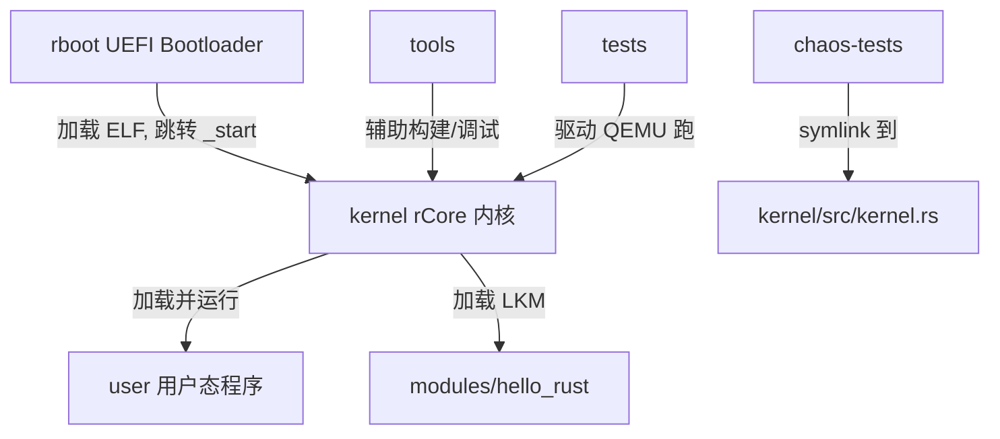

# Chaos 仓库架构概览

> 本仓库是基于 [rCore](https://github.com/rcore-os/rCore) 教学操作系统改造而来的"内核调试 & 重写"作业。核心调试目标是 [`kernel/src/kernel.rs`](kernel/src/kernel.rs)（一个嵌入了多处缺陷的单体内核模拟），由 [`chaos-tests/`](chaos-tests/) 提供基础 / 高级 / 压力三组测试驱动。完整的 rCore 内核 / 用户态 / Bootloader 源码也一并保留，便于在真实 QEMU 环境中运行。

## 1. 顶层目录

| 路径 | 作用 |
| --- | --- |
| [README.md](README.md) | 作业说明：禁止直接用 LLM 产生最终代码，必须提交 agent 对话日志，标注 HUMAN/AGENT；任务由 Debug（基础 20% + 高级 20% + 压力 20%）和 Code Review（重写 40%）组成 |
| [LICENSE](LICENSE) | MIT，2018-2020 rCore Developers |
| [.gitmodules](.gitmodules) | 子模块：`user` → `rcore-user`，`rboot` → `rboot` |
| [kernel/](kernel/) | 内核实现（多架构 rCore + `kernel.rs` 单体内核仿真） |
| [rboot/](rboot/) | x86_64 UEFI Bootloader（git submodule） |
| [user/](user/) | 用户态程序与 rootfs 构建脚本（git submodule，源自 rcore-user） |
| [chaos-tests/](chaos-tests/) | 针对 `kernel.rs` 的 Cargo 测试套件 |
| [modules/hello_rust/](modules/hello_rust/) | 内核可加载模块（LKM）的 Rust 模板 |
| [tools/](tools/) | Docker、OpenSBI、K210、addr2line、gdbinit、符号表填充脚本等支持工具 |
| [tests/](tests/) | 用 `*.cmd` + `*.out` 形式驱动 QEMU 跑回归的脚本（`test.sh`） |
| [.github/workflows/main.yml](.github/workflows/main.yml) | CI：`cargo fmt --check`，矩阵构建 5 个架构 × ubuntu/macOS，安装 QEMU、构建 user image 与内核，x86_64 额外构建 `HYPERVISOR=on` |

## 2. 模块关系



`chaos-tests/src/lib.rs` 通过软链接指向 [`kernel/src/kernel.rs`](kernel/src/kernel.rs)，因此所有对内核源文件的修改都会立即反映到测试套件。

## 3. kernel —— 内核实现

入口：[`kernel/src/main.rs`](kernel/src/main.rs)（`no_std` 壳） + [`kernel/src/lib.rs`](kernel/src/lib.rs)（声明所有子模块、定义全局堆 `HEAP_ALLOCATOR` 与主循环 `kmain`）。
依赖：见 [`kernel/Cargo.toml`](kernel/Cargo.toml)，关键有 `buddy_system_allocator` / `bitmap-allocator`、`smoltcp`（网络栈）、`rcore-fs-*`（VFS / SFS / RAMFS / DEVFS）、`isomorphic_drivers`、`virtio-drivers`、`trapframe`、可选的 `rvm`（虚拟化）。

### 3.1 子模块职责

| 路径 | 作用 |
| --- | --- |
| [src/kernel.rs](kernel/src/kernel.rs) | **作业核心目标**：约 6400 行的单体内核仿真，覆盖锁 / 内存 / 调度 / 文件系统 / IPC / 信号等子系统，含有意嵌入的 bug |
| [src/arch/](kernel/src/arch/) | 体系结构相关代码（详见下表） |
| [src/drivers/](kernel/src/drivers/) | 设备驱动框架（详见下表） |
| [src/syscall/](kernel/src/syscall/) | 系统调用分发：[mod.rs](kernel/src/syscall/mod.rs) 中的 `handle_syscall` 异步分发到 fs/ipc/lkm/mem/misc/net/proc/signal/time/user/custom 等子模块 |
| [src/signal/](kernel/src/signal/) | Linux 信号机制：`Signal` 1-64 号、`send_signal` / `handle_signal`、`SignalFrame` / `SignalStack` 等 |
| [src/net/](kernel/src/net/) | 基于 `smoltcp` 的网络数据结构与测试服务器 |
| [src/lkm/](kernel/src/lkm/) | 内核可加载模块管理：`api`、`const_reloc`、`kernelvm`、`manager`、`structs` |
| [src/rvm/](kernel/src/rvm/) | RVM 虚拟化集成（`feature = "hypervisor"`） |
| [src/fs/](kernel/src/fs/) | 通过 `rcore-fs-*` 接入 VFS / SFS / RAMFS / DEVFS / mountfs |
| [src/memory/](kernel/src/memory/) | 物理 / 虚拟内存、堆扩展（`enlarge_heap`）、`MemorySet` |
| [src/process/](kernel/src/process/) | 进程 / 线程模型 |
| [src/ipc/](kernel/src/ipc/) | System V IPC：信号量 / 共享内存等 |
| [src/sync/](kernel/src/sync/) | 自旋锁、`Condvar`、`SpinNoIrq` 等同步原语 |
| [src/trap/](kernel/src/trap/) | 通用 trap 入口（架构无关层） |
| [src/shell.rs](kernel/src/shell.rs) | 内核 shell |
| [src/logging.rs](kernel/src/logging.rs) | 日志基础设施（`print!` 宏） |
| [src/backtrace.rs](kernel/src/backtrace.rs) | 内核栈回溯，配合 [tools/addr2line.py](tools/addr2line.py) 还原行号 |
| [src/lang.rs](kernel/src/lang.rs) | `panic_handler`、`alloc_error_handler` 等语言项 |
| [src/util/](kernel/src/util/) | 杂项工具 |

### 3.2 体系结构（src/arch）

通过 `cfg(target_arch = …)` 在 [lib.rs](kernel/src/lib.rs) 中切换：

| 目录 | 平台 / 板级 |
| --- | --- |
| [arch/x86_64/](kernel/src/arch/x86_64/) | `_start(boot_info)` 入口，子模块：`acpi`、`board`（QEMU / PC）、`consts`、`cpu`、`fp`、`gdt`、`interrupt`、`io`、`ipi`、`memory`、`paging`、`rand`、`signal`、`syscall`、`timer` |
| [arch/riscv/](kernel/src/arch/riscv/) | RISC-V 32 / 64，板级支持 `virt`、`u540`（HiFive Unleashed）、`rcore_vmm_guest` |
| [arch/aarch64/](kernel/src/arch/aarch64/) | ARMv8，主要面向 Raspberry Pi 3 |
| [arch/mipsel/](kernel/src/arch/mipsel/) | MIPS 小端，面向 Malta；DTB 直接链接到内核 |

各 ISA 应实现的接口约定在 [kernel/spec.md](kernel/spec.md) 中描述（`consts`、`cpu::id`、`timer::timer_now`、`interrupt::{ack, timer, wait_for_interrupt, handle_user_page_fault}`、`board::{early_init, init}` 等）。

### 3.3 驱动框架（src/drivers）

[drivers/mod.rs](kernel/src/drivers/mod.rs) 定义统一的 `Driver` trait（`try_handle_interrupt`、`device_type`、`get_id`，并支持向 `NetDriver` / `BlockDriver` / `RtcDriver` / `SerialDriver` 转型）：

| 子目录 | 内容 |
| --- | --- |
| [block/](kernel/src/drivers/block/) | `BlockDriver` + `ahci`、`ide`、`virtio_blk` |
| [net/](kernel/src/drivers/net/) | `NetDriver` + `e1000`、`ixgbe`、`virtio_net`，与 smoltcp 协议栈对接 |
| [serial/](kernel/src/drivers/serial/) | UART 串口实现（多种平台） |
| [console/](kernel/src/drivers/console/) | 字符控制台 |
| [gpu/](kernel/src/drivers/gpu/) | virtio-gpu 显示控制器 |
| [input/](kernel/src/drivers/input/) | 鼠标等输入设备 |
| [irq/](kernel/src/drivers/irq/) | `IrqManager` + `plic`、`bcm2837`（按 irq 号分发到驱动） |
| [rtc/](kernel/src/drivers/rtc/) | 实时时钟 |
| [mmc/](kernel/src/drivers/mmc/) | MMC / SD 卡控制器 |
| [bus/](kernel/src/drivers/bus/) | PCI、device tree 总线初始化 |
| [device_tree.rs](kernel/src/drivers/device_tree.rs) | 解析 DTB |
| [provider.rs](kernel/src/drivers/provider.rs) | 为 `isomorphic_drivers` 提供平台接口 |

### 3.4 构建系统

- [kernel/Makefile](kernel/Makefile)：核心 target 包括 `build` / `run` / `justrun` / `debug` / `asm` / `header` / `addr2line` / `sym` / `doc` / `clean`；可调变量 `ARCH`、`MODE`（debug/release）、`LOG`、`BOARD`（qemu/pc/u540/raspi3/rcore_vmm_guest/malta）、`SMP`、`NET`、`GRAPHIC`、`HYPERVISOR`、`UART2`、`ACCEL`、`PCI_PASSTHRU`、`INIT`、`FEATURES` 等。
- [kernel/targets/*.json](kernel/targets/)：5 个 `rustc` 自定义目标规范（aarch64 / mipsel / riscv32 / riscv64 / x86_64）。
- [kernel/build.rs](kernel/build.rs)：编译时生成链接脚本与常量。
- [kernel/spec.md](kernel/spec.md)：代码组织约定。

## 4. rboot —— x86_64 UEFI Bootloader

子模块（[Cargo.toml](rboot/Cargo.toml)，依赖 `uefi`、`xmas-elf`、`x86_64`）。[src/main.rs](rboot/src/main.rs) 中 `efi_main` 的工作流程：

1. 从 `\EFI\Boot\rboot.conf` 加载启动配置
2. 加载内核 ELF 文件
3. 将 ELF 段映射到虚拟内存
4. 映射内核栈与全部物理内存
5. 退出 boot service，跳转到内核 `_start(&BootInfo)`

## 5. user —— 用户态

子模块（来自 rcore-user），由 [user/Makefile](user/Makefile) 统一编排，按开关变量（`EN_RUST`、`EN_UCORE`、`EN_BISCUIT`、`EN_APP`、`EN_NGINX`、`EN_REDIS`、`EN_ALPINE`、`EN_IPERF3`、`EN_MUSL_GCC`、`EN_MUSL_RUST`、`EN_LIBC_TEST`、`EN_VMM`、`EN_RUST_RVM_VMM` 等）选择性构建：

| 子目录 | 内容 |
| --- | --- |
| [rust/](user/rust/) | `no_std` Rust 用户程序，使用自定义 target [user/rust/targets/*.json](user/rust/targets/) |
| [ucore/](user/ucore/) | uCore 教学 OS 的 C 程序（CMake） |
| [biscuit/](user/biscuit/) | MIT Biscuit 的 C/C++ 程序，链 musl |
| [app/](user/app/) | 自定义 musl 测试程序 |
| [nginx/](user/nginx/)、[redis/](user/redis/)、[iperf3/](user/iperf3/) | 真实服务程序 |
| [musl-gcc/](user/musl-gcc/)、[musl-rust/](user/musl-rust/) | 工具链 / 库 |
| [make/](user/make/) | GNU make 的用户态构建 |
| [alpine/](user/alpine/) | Alpine Linux 最小 rootfs |
| [testsuits_alpine/](user/testsuits_alpine/) | C / Python / Lua / Ruby / Go / Java / Rust 多语言测试程序 |
| [blank/](user/blank/) | 空白磁盘镜像 |

最终输出为 `build/$(ARCH).img`（SFS）和 `build/$(ARCH).qcow2`，被 [kernel/Makefile](kernel/Makefile) 的 QEMU 命令引用。

## 6. chaos-tests —— 测试套件

[Cargo.toml](chaos-tests/Cargo.toml) 声明三个 `[[test]]` 目标：

| 目标 | 入口 |
| --- | --- |
| `basic` | [tests/basic/main.rs](chaos-tests/tests/basic/main.rs)（导入 `group_01` … `group_11`） |
| `advanced` | `tests/advanced/main.rs` |
| `pressure` | `tests/pressure/main.rs` |

每个 `group_XX.rs` 是一组 `#[test]`，调用从 `chaos_tests::*`（即 `kernel/src/kernel.rs`）导出的内核仿真原语，统一通过 `run_with_timeout` 等辅助函数检测死锁 / hang。下面列出 `tests/basic` 中各组覆盖的子系统：

| 文件 | 受测子系统 | 主要用例与意图 |
| --- | --- | --- |
| [group_01.rs](chaos-tests/tests/basic/group_01.rs) | 全局内核锁 GKL（Big Kernel Lock） | `basic_bkl_single_acquire_release` 单次进入/离开；`basic_bkl_double_acquire_single_release` 重入计数 `GKL.level()`；`basic_cross_module_lock_order` 与 `FramePool` 协作时不死锁的跨模块加锁顺序 |
| [group_02.rs](chaos-tests/tests/basic/group_02.rs) | 自旋锁 `Spin` 与 `Channel` | `basic_spinlock_protect_data` 互斥保护原子计数；`basic_sleep_under_spinlock_uniprocessor` 单处理器下 `Channel::recv` 阻塞时不得持有自旋锁；`basic_spinlock_held_duration` 后获锁者等待时间 ≥ 持锁者睡眠时长 |
| [group_03.rs](chaos-tests/tests/basic/group_03.rs) | 条件变量 `SyncQueue` / `park_on` | `basic_condvar_signal_before_wait` 先 signal 后 wait 的丢失唤醒；`basic_spurious_wakeup_no_recheck` `broadcast` 后必须重检谓词；`basic_producer_consumer_single` 单生产者-单消费者唤醒 |
| [group_04.rs](chaos-tests/tests/basic/group_04.rs) | 物理页 `PgFrame` 引用计数与 CoW | `basic_refcount_increment_decrement` `up/down` 配对；`basic_refcount_concurrent_increment` 64 线程并发 `up` 的原子性；`basic_cow_single_thread` `SharedPage::fault` 触发 CoW 时正确分配新帧并递减源帧引用 |
| [group_05.rs](chaos-tests/tests/basic/group_05.rs) | 进程/任务表 `TaskTable` 与 `Task` 生命周期 | `basic_process_create_exit` `spawn` 后 `reap` 计数归零；`basic_weak_ref_after_drop` `Arc::downgrade` 后释放，弱引用失效；`basic_stale_weak_upgrade` 已回收任务的 stale 引用状态与新分配 ID 隔离 |
| [group_06.rs](chaos-tests/tests/basic/group_06.rs) | 块设备 `Disk` 读重试逻辑 | `basic_block_read_success` 正常读 0xAA 填充；`basic_block_read_single_retry` 单次失败后重试成功，总 IO 次数 = 2；`basic_block_read_infinite_retry` 无限失败时 `read_block_n` 必须遵守次数上限，且无限重试版本必然 hang（验证调用方需要带上限） |
| [group_07.rs](chaos-tests/tests/basic/group_07.rs) | 挂载表 `MountTable` 与路径解析 | `basic_path_resolve_simple` 无挂载点的直通解析；`basic_mount_then_resolve` `bind` 后挂载点替换前缀为 `dev0:/file`；`basic_concurrent_mount_and_lookup` 并发 `bind` + `resolve` 不死锁/不损坏 |
| [group_08.rs](chaos-tests/tests/basic/group_08.rs) | 环形缓冲 `CircBuf` | `basic_ring_write_read` 顺序 push/pop；`basic_ring_full_reject` 满时拒绝写入；`basic_ring_wrap_around` 头尾绕回后仍正确 FIFO |
| [group_09.rs](chaos-tests/tests/basic/group_09.rs) | 体系结构层：寄存器上下文与陷阱控制 `TrapCtl` | `basic_save_restore_context` `Context::capture/apply` 保存恢复 `N_REGS` 寄存器；`basic_interrupt_mask_set` 中断屏蔽位写入硬件寄存器；`basic_page_fault_in_process_context` 在进程上下文中正确处理缺页 |
| [group_10.rs](chaos-tests/tests/basic/group_10.rs) | 用户地址校验 `check_access` 与僵尸进程回收 | `basic_access_ok_valid_range` 合法用户区允许，`KERN_BASE` 之上拒绝；`basic_access_ok_overflow` 长度 `usize::MAX` 溢出必须判为非法；`basic_zombie_single_child` `fork_task` + `reap` 后子进程消失而父进程保留 |
| [group_11.rs](chaos-tests/tests/basic/group_11.rs) | 端到端综合工作流（fork/exec、pipe IPC、mmap+文件 IO） | `basic_fork_exec_workload` 组合 `Kernel::new/proc_init` + 4 帧分配 + CoW，最终空闲帧 = 59 且 `!GKL.held()`；`basic_pipe_ipc_workload` 单生产者-单消费者通过 `Channel` 传 200 字节、close 后消费者退出且数据有序；`basic_mmap_file_io_workload` `check_access` 与帧池/CoW 联动，验证 `0x1000 + usize::MAX` 溢出判定 |

运行方式（来自 [README.md](README.md)）：

```bash
cargo test --test basic
cargo test --test advanced
cargo test --test pressure
```

也可以单独跑某一组，例如 `cargo test --test basic -- group_01`。

## 7. modules/hello_rust —— LKM 模板

Rust 内核可加载模块的脚手架（[Cargo.toml](modules/hello_rust/Cargo.toml) + [build.rs](modules/hello_rust/build.rs) + [build.sh](modules/hello_rust/build.sh) + [lkm_info.txt](modules/hello_rust/lkm_info.txt)）。`src/` 包含 `lib.rs`、`arch/x86_64/`、`main/`。约束（见 [README.txt](modules/hello_rust/README.txt)）：模块必须与内核使用同一 toolchain，并在内核重建后随之重建。

## 8. tools —— 支持工具

| 路径 | 用途 |
| --- | --- |
| [docker/](tools/docker/) | 包含编译工具链与 QEMU 的 Dockerfile |
| [opensbi/](tools/opensbi/) | RISC-V OpenSBI 固件预编译产物（`fw_jump.elf`、`fu540.elf`、`k210.elf`） |
| [k210/kflash.py](tools/k210/kflash.py) | K210 RISC-V 芯片烧录工具 |
| [u540/mkimg.sh](tools/u540/mkimg.sh) | HiFive U540 引导镜像生成 |
| [raspi-firmware/config.txt](tools/raspi-firmware/config.txt) | 树莓派固件配置 |
| [fill_symbols/](tools/fill_symbols/) | 用 `nm` + `gzip` 把内核符号表写入 ELF 的 `rcore_symbol_table` 段，供运行时 backtrace 使用 |
| [addr2line.py](tools/addr2line.py) | 把内核 backtrace（PC / FP）批量转为源码位置 |
| [gdbinit](tools/gdbinit) / [gdbinit-sbi](tools/gdbinit-sbi) | GDB 调试脚本 |
| [pkttop.sh](tools/pkttop.sh) | 网络包分析 |
| [syscall_64.tbl](tools/syscall_64.tbl) | x86_64 系统调用号表 |

## 9. tests —— QEMU 回归脚本

[test.sh](tests/test.sh)：先 `make sfsimg arch=riscv32`，再遍历目录中的 `*.cmd`（程序名）与 `*.out`（期望输出），用 `timeout 10s make justruntest` 运行后 diff 比对，例如 [hello_rust.cmd](tests/hello_rust.cmd) / [hello_rust.out](tests/hello_rust.out)。

## 10. CI

[.github/workflows/main.yml](.github/workflows/main.yml)：

- `check` job：在 `kernel/` 下运行 `cargo fmt -- --check`，工具链锁定 `nightly-2020-06-04`。
- `build` job：矩阵 `os = {ubuntu, macos} × arch = {x86_64, riscv32, riscv64, aarch64, mipsel}`；安装 QEMU 4.2.0、`device-tree-compiler`，下载 `PREBUILT=1` 的 user image，跑 `make build`；x86_64 + Linux 上额外编译 `HYPERVISOR=on`。

---

**调试入口建议**：先 `cargo check`（解决编译期 bug），再按组运行 `cargo test --test basic -- group_01` 等逐步推进，最后整体重构 [kernel/src/kernel.rs](kernel/src/kernel.rs) 以满足 Code Review 的可读性要求。
